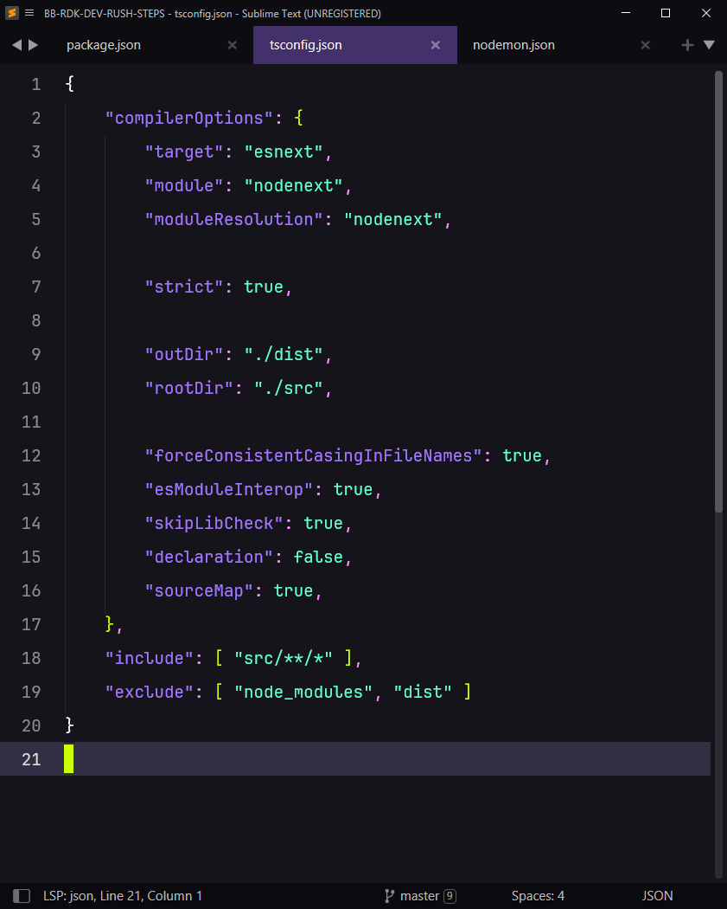

# Proyecto TypeScript #

---
## 01. Crear Proyecto ##

01.01 Terminal o Cmd
```bash
$ which node
$ node -v
```
> La **versión** instalada de **Node** debe ser al menos **22.6**

01.02 Terminal o Cmd
```bash
$ mkdir ts-project
$ cd ts-project
$ npm init -y
```

01.03 Instalar dependencias
> La versión de **TypeScript** deber ser **5.9.2**
```bash
$ npm i -D typescript@5.9.2
$ npm i -D nodemon
```

---
## 02. Configurar Proyecto ##
02.01 Archivo **package.json**


02.02 Archivo **tsconfig.json**


02.03 Archivo **nodemon.json**


---
## 03. Estructura de Carpetas ##

```
📁 mi-proyecto/
├── 📁 node_modules/
│
├── 📁 dist/
│   ├── 📄 app.js
│   └── 📄 utils.js
│
├── 📁 src/
│   ├── 📄 app.ts
│   └── 📄 utils.ts
│
├── 📄 nodemon.js
├── 📄 package-lock.js
├── 📄 package.js
└── 📄 tsconfig.js
```

---
## 04 Código fuente ##

04.01 Archivo src/app.ts
> Modifica el valor de **numOne** y **numTwo** antes de cada operación


04.02 Archivo src/utils.ts


---
## 05 Ejecutar Proyecto ##
> Cada tarea debe ejecutarse en ventanas separadas

05.01 Transpilar Ts > Js
```bash
$ npm run dev:ts
```

05.02 Ejecutar Js
```bash
$ npm run dev:js
```

05.03 Resultado esperado:
```bash
2 + 3 = 5
2 - 3 = -1
8 + 7 = 15
--- Historial de Operaciones ---
2 + 3 = 5
2 - 3 = -1
8 + 7 = 15
```
