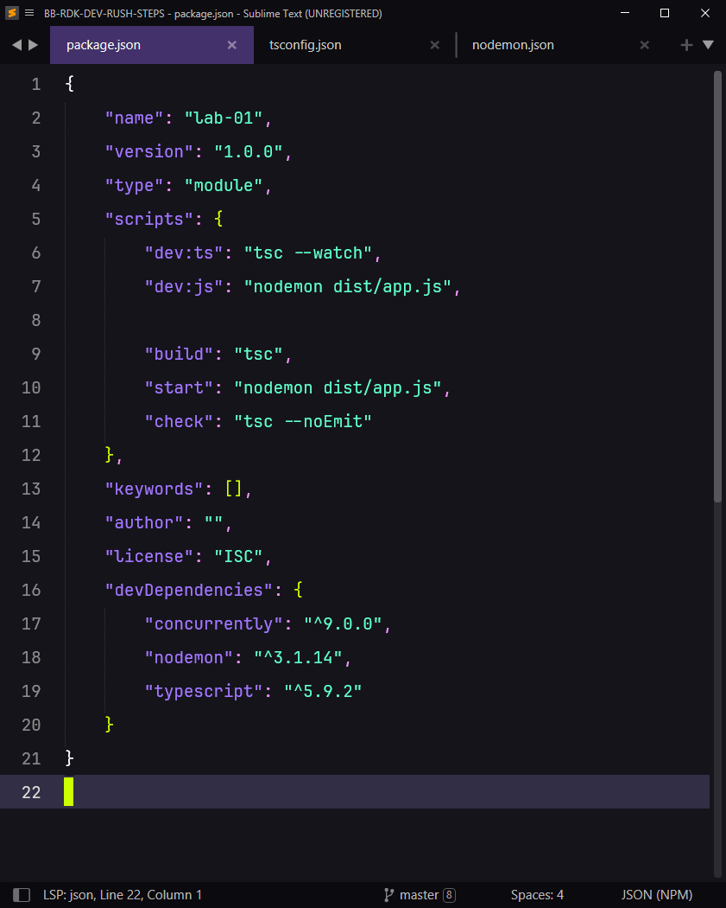
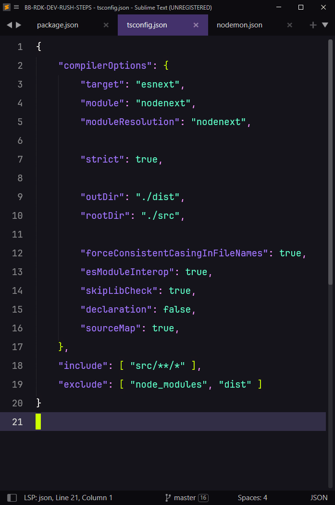
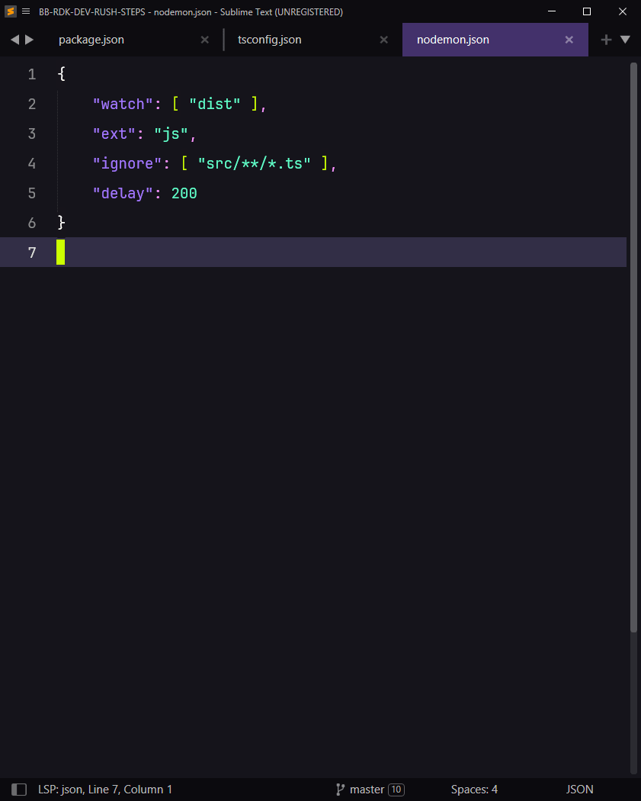
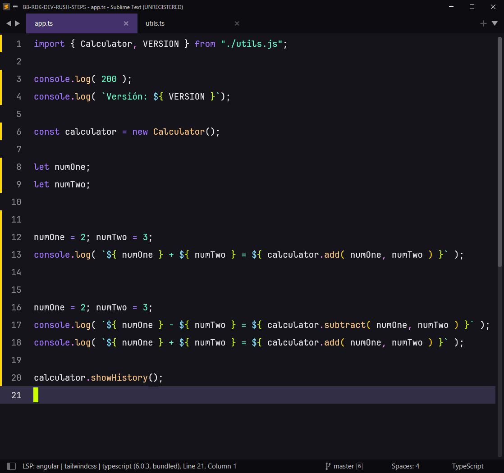
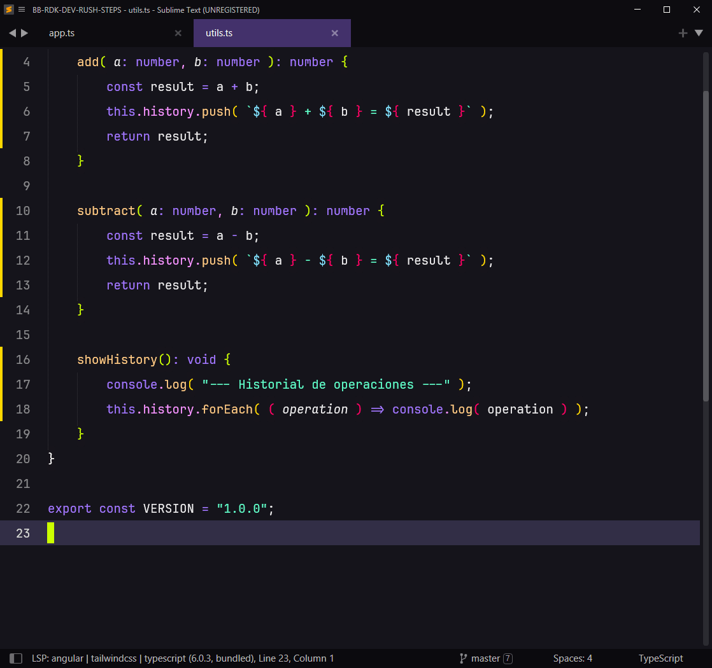

# Proyecto TypeScript #

## 01. Estructura de Carpetas ##

> [!NOTE]
> Estos son los archivos y/o carpetas principales del proyecto.
> Algunos se van a generar automáticamente.
> Algunos se van a generar manualmente.


```
📁 ts-project/
├── 📁 node_modules/
│
├── 📁 dist/
│   ├── 📄 app.js
│   └── 📄 utils.js
│
├── 📁 src/
│   ├── 📄 app.ts
│   └── 📄 utils.ts
│
├── 📄 nodemon.json
├── 📄 package-lock.json
├── 📄 package.json
└── 📄 tsconfig.json

```

---

## 02. Crear Proyecto ##

02.01 Terminal o Cmd

> [!CAUTION]
> La **versión** instalada de **Node** debe ser al menos **22.6**

```bash
$ which node
$ node -v
```


02.02 Terminal o Cmd

> [!NOTE]
> El comando `$ npm init -y` crea el archivo **package.json**

```bash
$ mkdir ts-project
$ cd ts-project
$ npm init -y
```

02.03 Instalar dependencias

> [!CAUTION]
> La versión de **TypeScript** deber ser la **5.9.2**

> [!NOTE]
> El comando `$ npm i ` modifica el archivo **package.json**

```bash
$ npm i -D typescript@5.9.2
$ npm i -D nodemon
```

02.04 **Crear archivos de configuración** en la **carpeta raíz del proyecto**

> [!NOTE]
> Se puede crear con el comando **`$ touch`**
> Se puede crear desde el **Sistema Operativo**
> Se puede crear desde el **Editor de Código**

02.04.01 Crear archivo **tsconfig.json**
Crear el archivo ***tsconfig.json*** en la carpeta raíz del proyecto

02.04.02 Crear archivo **nodemon.json**
Crear el archivo ***nodemon.json*** en la carpeta raíz del proyecto


---
## 03. Configurar Proyecto ##
03.01 Configurar archivo **package.json**

> [!NOTE]
> Actualiza el archivo **package.json** con las siguientes opciones




03.02 Archivo **tsconfig.json**

> [!NOTE]
> Actualiza el archivo **tsconfig.json** con las siguientes opciones



03.03 Archivo **nodemon.json**

> [!NOTE]
> Actualiza el archivo **nodemon.json** con las siguientes opciones




---
## 04 Código Fuente ##

04.01 **Crear Archivos** en la **Carpeta Principal del Proyecto**

> [!NOTE]
> Se puede crear con el comando **`$ touch`**
> Se puede crear desde el **Sistema Operativo**
> Se puede crear desde el **Editor de Código**

04.01.01 Crear archivo **src/app.ts**
04.01.02 Crear archivo **src/utils.ts**


04.02 **Actualizar** archivo **src/app.ts**

> [!NOTE]
> Actualiza el archivo **src/app.ts** con las siguientes opciones




04.03 **Actualizar** archivo **src/utils.ts**

> [!NOTE]
> Actualiza el archivo **src/utils.ts** con las siguientes opciones



---
## 05 Ejecutar Proyecto ##

> [!NOTE]
> Cada tarea debe ejecutarse en ventanas separadas

> [!NOTE]
> A diferencia de los IDEs (Visual Studio, IntelliJ Idea, Eclipse, etc.), allí un mismo botón ejecuta la compilación (Build/Compile) y la ejecución (Run) de manera consecutiva y conjunta (Build & Run), pero también lo pueden hacer de forma separada que no es lo más común.
> Con dos terminales se hacen las mismas tareas que esos IDEs uno para Compilar/Transpilar (`$npm run dev:ts`) y otro para ejecutar el Código Transpilado (`$npm run dev:js`)

05.01 **Transpilar** de ***TypeScript*** a ***JavaScript***
```bash
$ npm run dev:ts
```

05.02 Ejecutar Js
```bash
$ npm run dev:js
```

05.03 Resultado esperado:

> [!NOTE]
> Los resultados pueden variar, según los valores de las variables

```bash
2 + 3 = 5
2 - 3 = -1
8 + 7 = 15
--- Historial de Operaciones ---
2 + 3 = 5
2 - 3 = -1
8 + 7 = 15
```
